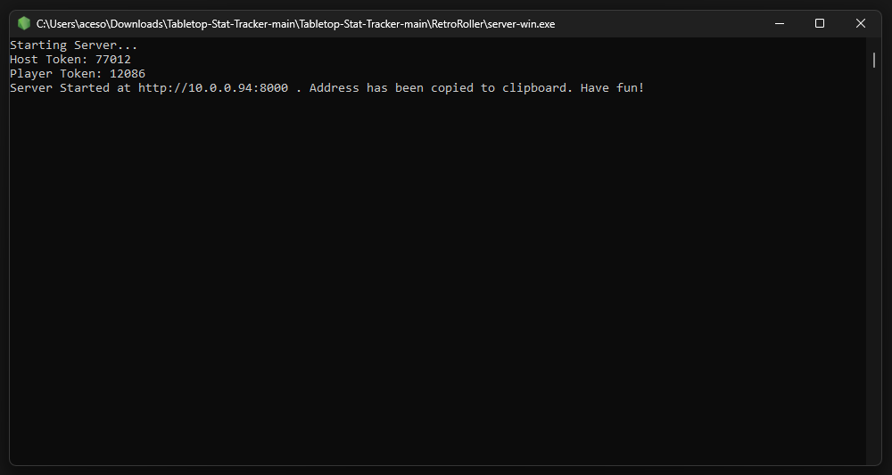
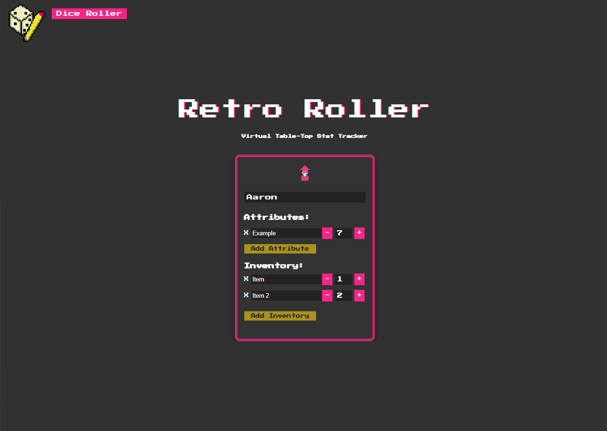
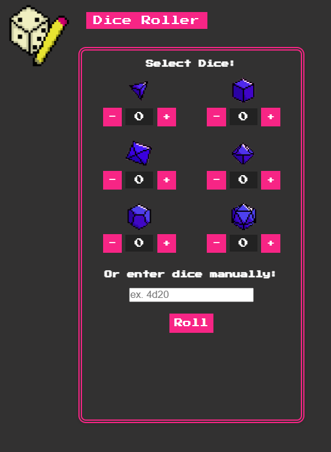
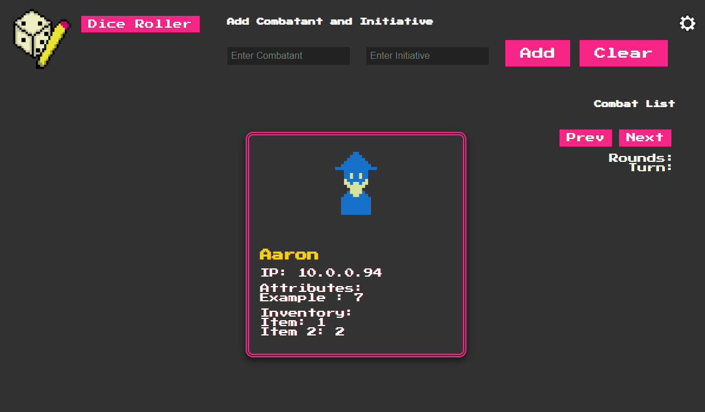
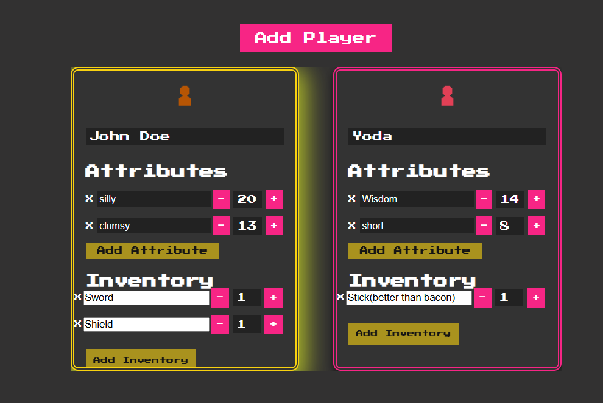
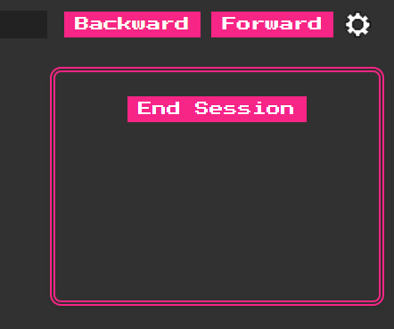

    

# Retro Roller
---

## Team Members:
&nbsp; Mike Lisenko (mikelisenko)
&nbsp; Olivia Cheng (oliviaccheng)
&nbsp; McKinley Harmon (McKinley57)
&nbsp; Cayden Hernandez (COHernandez117)
&nbsp; Aaron Sparks (AaronSparks2022)

## Introduction:
&nbsp; &nbsp; &nbsp; &nbsp; It can be a little overwhelming the amount of stuff to keep track of and write down in a TT game, but it doesn't have to be. With this piece of software that is what we intend to solve. Using a simple UI and non-invasive controls, we hope to create an environment conducive to making the entry into TT a better experience. In addition, we also hope to have returning players find our software an easy-to-implement solution to many different applications that were used before.

## Description:
&nbsp; &nbsp; &nbsp; &nbsp; To make starting the journey into tabletops easier. Players can expect to find the following:
- Player cards updated in real-time
- initiative tracker for combat
- enemy tracker for combat
- dice roller for quick results

## How to start:
&nbsp; &nbsp; &nbsp; &nbsp; To get started, install the Tabletop-Stat-Tracker repository. Then, the server executable (server-win.exe, server-linux, servermacos for each respective operating system) file should be run by the GM. This file is found in **/Tabletop-Stat-Tracker/RetroRoller/**. After this is run, all players and the GM should go to the IP of the machine on port 8000 on your web browser of choice (for example, http://10.0.0.149:8000). The host's IP will be automatically copied to the clipboard for easy sharing). On the first start, your operating system should prompt you to allow the program through your system's firewall, allowing other players to join your session. 

&nbsp; &nbsp; &nbsp; &nbsp; Once there, you will find a login screen asking for what kind of player you are: GM or player. After that, a session token will be needed in order to login, the session token is given by the server command prompt at startup. Once used, you will find the main UI of the software.

## Players:

&nbsp; &nbsp; &nbsp; &nbsp; Players can edit their cards with attributes and inventory items, which will be shared to other players and the GM. You can click on the small icon to change it.

## Dice roller:

&nbsp; &nbsp; &nbsp; &nbsp; Starting back at the top an working clock wise, we see a dice roller button. This dropdown will work one of two ways:
- the text field 
- the dice counters
If the text field is used, then a specific format must be used as follows:
##d##
The first set of "##" is the number of dice you wish to roll. The second "##" is the type of dice you are rolling. To put it into words, you could read "4d20" as "I am rolling 4 20 sided dice". The second way of doing it is to use the counters, they work in the same kind of way, except you are using a counter to say how many dice you want to roll. Keep in mind only one can be used at a time, so choose wisely!

## Host View:

&nbsp; &nbsp; &nbsp; &nbsp; Looking to the top right we see our intitiative tracker. This is used for tracking whose turn it is during combat! To use, simply type in the player names in the order you rolled for intitative then use the forward, and sometimes backward, button as needed. The player whose tuen it is should glow to make it easier to know who is going!

## Settings:

&nbsp; &nbsp; &nbsp; &nbsp; To the immediate right of the init tracker is the settings button. In there, you will find the button to end you current session. This allows you to save your current data and play again next time you're ready, I hope you enjoyed your session!
